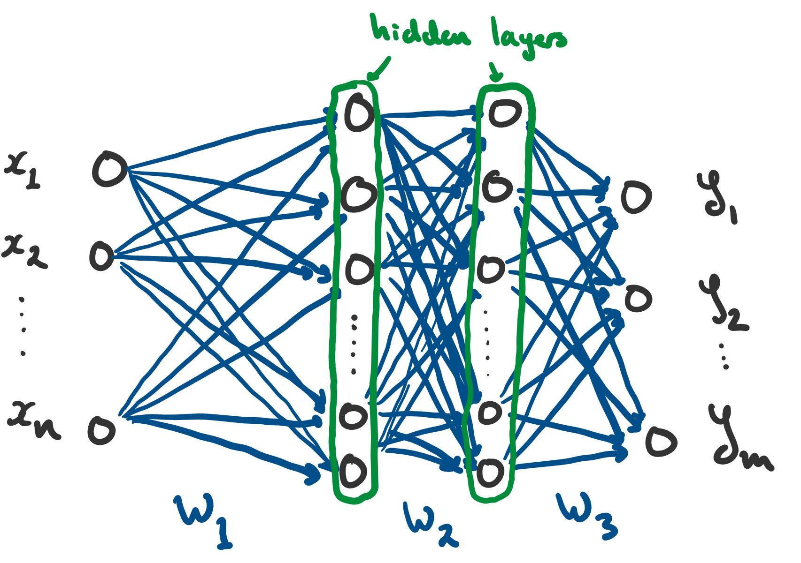

% Machine Learning, with Examples in PyTorch
% Matthew Mahowald
% August 13, 2021

# Outline

1. What is machine learning?
    a. Supervised learning
    b. Unsupervised learning
    c. Self-supervised learning
    d. Reinforcement learning
2. Deep learning
    a. A review of linear & logistic regression
    b. Gradient descent
    c. Neural nets
3. Why does deep learning work?
4. Common nets, implemented in PyTorch

---

## What is machine learning?

---

# What is machine learning?

**A possible definition**: 

Machine learning is a class of general purpose algorithms that utilize data to make predictions or decisions without being explicitly programmed to do so.

# A quick note on data

Most (but not all) machine learning algorithms take in real-valued vectors and produce real-valued vectors.

$$\left[\begin{matrix}1 & 2.5 & -3.6 & 0\end{matrix}\right]\overset{f}{\mapsto}\left[\begin{matrix}0.9 & 7 & -4.0\end{matrix}\right]$$

But what if your problem doesn't obviously involve numbers?

It turns out most things can be represented as vectors.

## Example 1: Coin flip

Heads = $[1]$, Tails = $[0]$

## Example 2: Classification: dog/cat/bird

Dog = $\left[\begin{matrix}1 & 0 & 0\end{matrix}\right]$, Cat = $\left[\begin{matrix}0 & 1 & 0\end{matrix}\right]$, Bird = $\left[\begin{matrix}0 & 0 & 1\end{matrix}\right]$

# More examples of data encodings

## Example 3: The alphabet

"a" = $\left[\begin{matrix}1 & 0 & \cdots & 0\end{matrix}\right]$

"b" = $\left[\begin{matrix}0 & 1 & \cdots & 0\end{matrix}\right]$

$\vdots$

"z" = $\left[\begin{matrix}0 & 0 & \cdots & 1\end{matrix}\right]$

(this is called a "one-hot" encoding)

## Example 4: Images

- Each pixel may be represented as a tuple $(r, g, b)$, where $r$ determines the red content, $g$ the green content, and $b$ the blue content.

- A whole image that is $W$ pixels wide and $H$ pixels high can be represented by an array of size $W \times H \times 3$.

# Why vectors?

Fundamentally, all machine learning models are mathematical functions, and therefore they must act on mathematical objects. (And an array of real numbers is the easiest nontrivial mathematical object to do computations with.)

# 3 (& $\frac{1}{2}$) Types of Machine Learning Algorithms

1. Supervised learning
2. Unsupervised learning

    (2.5) Self-supervised learning

3. Reinforcement learning

In all 3.5 cases, the output of the algorithm is a **model**, or more specifically, a collection of parameters $\theta = (\theta_1, \theta_2, \ldots, \theta_n)$ that define a specific instance of a particular class of models.

The type of algorithm determines _what_ class of model, and _how_ the parameters $\theta$ are chosen.

# Supervised learning

_Supervised_ : The algorithm is "taught" to produce outputs from inputs on a "training" dataset.

${}$

Many (most?) of the successful business applications of machine learning are supervised.

## Examples:

- **Image recognition**: Multi-label classification problem
- **Machine language translation**: Sequence-to-sequence multi-label classification
- **Credit scoring**: Estimate probability of loan default

# 1. Supervised learning

Main ingredients:

- A set of input data $X = \{x_1, x_2, \ldots, x_n\}$
- A set of desired outputs $Y = \{y_1, y_2, \ldots, y_n\}$

The goal is to construct a function (the _model_) $f: X \mapsto Y$ such that
$$f(x_i) \approx y_i$$
for all $i$.

Here, $\approx$ means that we want to minimize some measure of the error between the model's prediction $f(x_i)$ and the correct output $y_i$.

# 1. Supervised learning

$$f(x_i) \approx y_i$$
We can formalize the measure of error through a **loss function**:
$$\mathcal{L}(f(x_i), y_i)$$
Then, the goal is to find $f$ that minimizes the loss function $\mathcal{L}(f(x_i), y_i)$.

## Example

When $y_i \in \mathbb{R}$, common choices are the _mean squared error_:

$$\mathcal{L}(f(x_i), y_i) = \frac{1}{n} \sum_{i=1}^{n} \left(y_i - f(x_i) \right)^2$$

And the _mean absolute error_:

$$\mathcal{L}(f(x_i), y_i) = \frac{1}{n} \sum_{i=1}^{n} \left| y_i - f(x_i) \right|$$

# 1. Supervised learning: What about categorical problems?

The coinflip problem: $y_i = H$ with some (unknown) probability $p$, and otherwise $y_i = T$.
Suppose we also have a set of observed flips $\{y_1 = H, y_2 = T, \ldots, y_n = H\}$.
How do we estimate $p$?

The probability of that particular collection of flips is:

$$P(\{y_1, y_2, \ldots, y_n\}) = \left( \prod_{y_i = H} p \right) \left( \prod_{y_j = T} (1 - p) \right)$$

Maximizing this probability (the _likelihood_) is the same as maximizing the log-probability:

$$\log P = \sum_{y_i = H} \log p + \sum_{y_i = T} \log (1 - p)$$

# 1. Supervised learning: Categorical cross-entropy

The log-probability was
$$\log P = \sum_{y_i = H} \log p + \sum_{y_i = T} \log (1 - p)$$
Now suppose that the probability varies with each flip based on some feature $x_i$, and set $f(x_i) := P(y_i = H | x_i)$.
Then the _log likelihood_ is
$$\log P(\{y_1, y_2, \ldots, y_n\}) = \sum_{y_i = H} \log f(x_i) + \sum_{y_j = T} \log f(x_j)$$

Thus the negative log likelihood gives a _categorical loss function_:
$$\mathcal{L}(y_i, f(x_i)) := - \left( \sum_{y_i = H} \log f(x_i) + \sum_{y_j = T} \log f(x_j) \right)$$
This is called _categorical cross entropy_.

# 2. Unsupervised learning

_Unsupervised_ : The algorithm is not supplied with an "answer key", and instead assigns data to (machine-learned) clusters based on patterns.

${}$

Compared to supervised learning, the main disadvantage is that clusters identified by these approaches may not have useful/actionable interpretations.

## Examples

- **Anomaly detection**: Identify observations that are distinct and unusual relative to the rest of the data
- **Recommendation engines**: Users with similar characteristics are supplied similar product recommendations
- **Topic modeling**: Determine the topic associated with a particular sequence of text

# 2. Unsupervised learning

Main ingredients:

- A set of input data $\{x_1, x_2, \ldots, x_n\}$
- A distance/similarity metric $d(x, y)$

**Distance metric**: In order to tell how similar two observations $x_i$ and $x_j$ are to each other, we need to define a distance metric $d$ such that $d(x_i, x_i) = 0$ and $d(x_i, x_j) \geq 0$ for all $i$, $j$.

When no notion of distance is supplied, the implied choice is the _Euclidean distance_:
$$d(x_i, x_j) = \sqrt{(x_{i,1} - x_{j,1})^2 + (x_{i,2} - x_{j,2})^2 + \cdots + (x_{i,m} - x_{j,m})^2}$$

But sometimes this is not the right choice!

# 2.5 Self-supervised learning

A blend of supervised and unsupervised learning.

- Supervised: $y_i = x_i$

- Unsupervised: $\mathcal{L}(y_i, f(x_i)) = \mathcal{L}(x_i, f(x_i)) = d(x_i, f(x_i))$ 

## Examples

- **Anomaly detection** (again): Measure the distance between the input and the output; anomalous values will not be easily reconstructed.
- **Compression/Encoder-decoder**: The input $x_i$ is mapped (encoded) to a smaller representation, and then decompressed (decoded) back to the original input.

# 3. Reinforcement learning

An agent is taught to act in an environment, with the goal of maximizing some reward.


## Examples

- **AlphaZero/AlphaStar/etc**: game-playing models
- **Robot control**: e.g. teach a robotic arm to install a car bumper

# 3. Reinforcement learning

Main ingredients:

- An **environment** which takes an action $a_t$ and a state $s_t$ and produces a new state $s_{t+1}$
- An **agent** which takes a state $s_t$ and produces an action $a_t$
- A **reward function** $R$ which takes a tuple $(s_t, a_t, s_{t+1})$ and produces a reward $r_t$

A sequence $\tau = (s_1, a_1, s_2, a_2, \ldots, a_{n-1}, s_n)$ is called a **trajectory**.

The goal is to find a function $\pi$ (the **policy**) which maximizes the expected reward across many trajectories:

$$J(\pi) := \mathbb{E}_{\tau \sim \pi} \left[\sum_{t=1}^{n} R(s_t, a_t = \pi(s_t), s_{t+1}) \right]$$

# Advantages and Drawbacks of Different Approaches

\tiny

+--------------------+-----------------------------------------------+---------------------------------------+-----------------------------------+----------------------------------------------+
|                    | Supervised                                    | Unsupervised                          | Self-supervised                   | Reinforcement                                |
+====================+===============================================+=======================================+===================================+==============================================+
| **Advantages**     | $\cdot$ Easiest to implement                  | $\cdot$ No explicit labels needed     | $\cdot$ No explicit labels needed | $\cdot$ Closest match to biological learning |
|                    |                                               |                                       |                                   |                                              |
|                    | $\cdot$ Most control over performance         | $\cdot$ Good for data exploration     |                                   | $\cdot$ Highly flexible behaviors            |
+--------------------+-----------------------------------------------+---------------------------------------+-----------------------------------+----------------------------------------------+
|                    |                                               |                                       |                                   |                                              |
+--------------------+-----------------------------------------------+---------------------------------------+-----------------------------------+----------------------------------------------+
| **Disadvantages**  | $\cdot$ Need explicit labels                  | $\cdot$ Results not always useful for | $\cdot$ Limited applications      | $\cdot$ Very sample-inefficient              |
|                    |                                               | the selected task                     |                                   |                                              |
|                    | $\cdot$ Sensitive to choice of loss function  |                                       |                                   | $\cdot$ May not converge to viable policy    |
|                    |                                               |                                       |                                   |                                              |
|                    | $\cdot$ Models are only as good as the labels |                                       |                                   | $\cdot$ Difficult to design a good reward    |
+--------------------+-----------------------------------------------+---------------------------------------+-----------------------------------+----------------------------------------------+

\normalsize

---

## Deep learning

---

# Linear regression

$$\hat{y_i} = \theta_0 + \theta_1 x_{i,1} + \theta_2 x_{i, 2} + \cdots + \theta_n x_{i,n}$$

The input $x_i = (x_{i, 1}, x_{i, 2}, \ldots, x_{i, n})$ are the observations (vectors), where the $x_{i, k}$ is the $k$th _feature_ of the observation.
$\hat{y_i}$ is the model's _predicted_ valule given the input $x_i$.
$\theta_{k}$ are the _parameters_ of the model.

Can re-write LR as a matrix equation:

$$\hat{y_{i}}=\theta_{0}+\left[\begin{matrix}\theta_{1} & \theta_{2} & \cdots & \theta_{n}\end{matrix}\right]\left[\begin{matrix}x_{i,1}\\
x_{i,2}\\
\vdots\\
x_{i,n}
\end{matrix}\right]$$

# Linear regression

## What if $y_i$ is a vector, too?

Then there are a lot of parameters $\theta_{j,k}$!

$$\left[\begin{matrix}\hat{y}_{i,1}\\
\hat{y}_{i,2}\\
\vdots\\
\hat{y_{i,m}}
\end{matrix}\right]=\left[\begin{matrix}\theta_{1,1} & \theta_{1,2} & \cdots & \theta_{1,n}\\
\theta_{2,1} & \theta_{2,2} & \cdots & \theta_{2,n}\\
\vdots & \vdots & \ddots & \vdots\\
\theta_{m,1} & \theta_{m,2} & \cdots & \theta_{m,n}
\end{matrix}\right]\left[\begin{matrix}x_{i,1}\\
x_{i,2}\\
\vdots\\
x_{i,n}
\end{matrix}\right]+\left[\begin{matrix}\theta_{0,1}\\
\theta_{0,2}\\
\vdots\\
\theta_{0,m}
\end{matrix}\right]$$

Or more compactly:

$$\hat{y_i} = W x_{i} + b$$

Observe that **linear regression is a supervised learning problem**.
For univariate regression, the loss function is:

$$\mathcal{L}(y_i, f(x_i)) = \frac{1}{N} \sum_{i=1}^N \left( y_i - \hat{y_i} \right) ^2$$

# Logistic regression

Sometimes, we want to predict probabilities (classification) rather than real numbers (regression).
In this case, we have

$$\hat{y_i} = \sigma ( W x_{i} + b)$$

where $\sigma$ is some _linking function_---for example, the sigmoid function:

$$\sigma(x) = \frac{e^{x}}{1 + e^{x}}$$

(the sigmoid function maps every real number to a number on the interval $[0, 1]$).

Fitting this kind of model is also an example of supervised learning (where the loss function is the categorical cross-entropy).

# How do we find weight matrices that minimize the loss function?

For classical univariate linear regression, you can actually solve the equation analytically.
In general, you need to use a numerical optimization algorithm.

One way is gradient descent:

$$\theta_{k+1}=\theta_{k} - \gamma \left.\nabla_{\theta}\mathcal{L}(y,f_{\theta}(x))\right|_{\theta=\theta_{k}}$$

where $\gamma$ is the "learning rate" (the step size).

**_If_** the loss function is convex in $\theta$, then gradient descent is guaranteed to converge to the global minimum.

---

##  Okay, but I thought this talk was about deep learning...

---

# Logistic regression is a neural net!

Recall that logistic regression was defined by:
$$\hat{y} = \sigma ( W x + b)$$
where $x$, $\hat{y}$, and $b$ are all vectors, and $\sigma$ is applied elementwise.

Now imagine that instead of a single matrix of weights $W$ and bias $b$, we stack a sequence of them:

$$\hat{y}=W_{3}\left(\sigma\left(W_{2}\left(\sigma\left(W_{1}x+b_{1}\right)\right)+b_{2}\right)\right)+b_{3}$$

This is the mathematical definition of a "feed forward" neural net with 3 hidden layers and activation function $\sigma$.

# A picture of a neural net

{ width=275px }

- Each "neuron" is a component of some vector
- The weights $W_i$, $b_i$ define the "connections" between neurons in the network
- Biological neural nets do not really function this way.

# What are hidden layers?

Suppose that $x$ is an $n$-dimensional vector, and $y$ is an $m$-dimensional vector.

Consider our example:

$$\hat{y}=W_{3}\left(\sigma\left(W_{2}\left(\sigma\left(W_{1}x+b_{1}\right)\right)+b_{2}\right)\right)+b_{3}$$

Matrix $W_1$ must be dimension $k_1 \times n$ for some $k_1$, $W_2$ must be dimension $k_2 \times k_1$, and $W_3$ must be dimension $m \times k_3$.

In particular we are free to choose $k_1$, $k_2$, and $k_3$ to be arbitrary positive integers.
These intermediate vectors are the "hidden layers" in the network.


# Another perspective on neural nets

Consider again
$$\hat{y}=W_{3}\left(\sigma\left(W_{2}\left(\sigma\left(W_{1}x+b_{1}\right)\right)+b_{2}\right)\right)+b_{3}$$
Let $\tilde{x}$ denote the "latent representation"
$$\tilde{x} = \sigma\left(W_{2}\left(\sigma\left(W_{1}x+b_{1}\right)\right)+b_{2}\right)$$
Then, the defining equation of the neural net is just linear (or logistic) regression on this latent representation!
$$\hat{y} = W_3 \tilde{x} + b_3$$

**$\implies$ We can think of a neural net as being a combination of feature engineering and then classic linear or logistic regression!**

# Yet another perspective on neural nets

Neural nets are approximately piecewise linear functions:

{ width=275px }

When the activation function is ReLU, they are exactly piecewise linear!

# Why are neural nets so successful?

## 1. They are universal approximators

More precisely, they're "dense in $L^{2}(\mathbb{R}^n)$": for any function $f$ and any $\epsilon > 0$, there exists a neural net $g$ such that
$$\sqrt{\int_{\mathbb{R}^{n}}\left|f(x)-g(x)\right|^{2}dx}\leq\epsilon$$

- $L^{2}(\mathbb{R}^n)$ includes basically all but the very worst-behaved real-valued functions, so this means **in theory** a net can model just about any function
- But, being dense in $L^{2}(\mathbb{R}^n)$ isn't all that special---polynomials are too!

# Why are neural nets so successful?

## 2. They are conservative interpolators

{ width=275px }

# Why are neural nets so successful?

## 3. Gradient descent is surprisingly effective in high dimensions

{ width=275px }

# Why are neural nets so successful?

{ width=275px }

As the dimension of the parameter space increases, as long as the local minimum is finite, it becomes increasingly difficult to find gradient paths that will get stuck.

A typical neural net may have a 100,000-dim'l parameter space!

---

## Examples

---

# Common neural architectures: Fully connected feed-forward ("multilayer perceptron")

This is the most basic type of network:

{ width=275px }

In PyTorch this can be implemented by:

```python
model = nn.Sequential(
    nn.Linear(n, k1),
    nn.ReLU(),
    nn.Linear(k1, k2),
    nn.ReLU(),
    # or add more hidden layers
    nn.Linear(k2, m),
    )
```

# Common neural architectures: Autoencoders

Autoencoders are (typically) just a special kind of feedforward network:

{ width=300px }

The network is trained to reproduce its output $x_i$ from its input $x_i$.
However, along the way, it must produce an "encoded" (typically, lower-dimensional) representation of the input, $c_i$.

# Common neural architectures: Autoencoders

Here's an example of an autoencoder in PyTorch:

\footnotesize

```python
class Autoencoder(nn.Module):
    def __init__(self, input_size, encoded_size):
        super().__init__()

        self.encode = nn.Sequential(
            nn.Linear(input_size, 128), nn.ReLU(), 
            nn.Linear(128, 128), nn.ReLU(),
            nn.Linear(128, encoded_size))
        self.decode = nn.Sequential(
            nn.Linear(encoded_size, 128), nn.ReLU(),
            nn.Linear(128, 128), nn.ReLU(),
            nn.Linear(128, input_size))
    
    def forward(self, x):
        return self.decode(self.encode(x))
```

\normalsize

# Common neural architectures: Recurrent networks

A recurrent network maintains a "hidden state", which is updated with each new input.

{ width=275px }

The most basic recurrent layer is just a dense layer:
$$h_{t} = \sigma ( W(x_{t}, h_{t-1}) + b)$$
where, if $x_{t}$ is dimension $n$ and $h_{t}$ is dimension $k$, then $W$ is a $k \times (k + n)$-dimensional matrix.

Typically, the hidden state $h_{t}$ is then used to as an input to subsequent feedforward layers to generate a prediction.

# Common neural architectures: Recurrent networks

Here's an explicit example of the previous slide's RNN:

\footnotesize

```python
class ModelRNN(nn.Module):
    def __init__(self, input_size, hidden_size):
        super().__init__()
        
        self.hidden_size = hidden_size
        self.rnn = nn.RNN(input_size, hidden_size)
        self.dense = nn.Sequential(
            nn.Linear(hidden_size, 128), nn.ReLU(), 
            nn.Linear(128, 128), nn.ReLU(), 
            nn.Linear(128, 1))
    
    def forward(self, x, h):
        x = torch.unsqueeze(x, 0)
        x, h = self.rnn(x, h)
        x = torch.squeeze(x, 0)
        x = self.dense(x)
        return x, h
```

\normalsize

# Tips and tricks to get the most out of your nets

- **Normalize your inputs**: Nets work best when each feature is drawn from an approximately normal distribution with mean 0 and std dev 1. (Do this by subtracting the _in-sample_ mean and dividing by the _in-sample_ std dev)

- **Use dropout and early stopping**: Dropout randomly zeros neurons during training; this helps prevent memorization of training data. And early stopping halts training when performance starts to degrade on the validation set.

- **When in doubt, enlarge and add more layers**: Traditional statistical wisdom about parameter counts (e.g. AIC/BIC) doesn't seem to apply as well to nets.

- **Check that your code works on CPU before running it on GPU**: If it breaks, at least you will know whether it's a GPU problem or not!

---

\centering

{ width=275px }

_image credit: unknown redditor_

---

## Thank you!